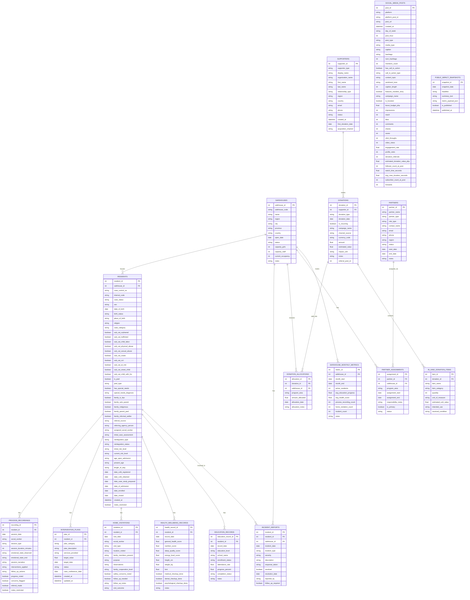

# HavenBridge — Design Spec

## Overview
HavenBridge is a nonprofit platform that connects case workers and donors to improve outcomes for vulnerable children in the Philippines. The system tracks resident progress across 9 safehouses, enables case management for social workers, and shows donors measurable impact.

---

## Implementation Status

| Feature | Status | Route / Location |
|---------|--------|------------------|
| Public landing page | Done | `/welcome` |
| Public impact dashboard | Done | `/impact` |
| Staff login + auth guard | Done | `/login` |
| Privacy policy + cookie consent | Done | `/privacy` |
| Staff overview dashboard | Done | `/` |
| Resident case dashboard (3-panel) | Done | `/cases` |
| Donor management dashboard | Done | `/donors` |
| Reports & analytics | Done | `/reports` |
| Admin portal (quick actions) | Done | `/admin` |
| Donor portal (external) | Done | `/donor-portal` |
| Search & filter on caseload | Done | Resident sidebar |
| Add Session / Visit / Donation forms | Done | Modal forms |
| CSV data importer (7,000+ rows) | Done | Startup import |
| Real database (17 tables, SQLite) | Done | `havenbridge.db` |
| Sign out | Done | Nav bar |

---

## Tech Stack
- **Backend:** ASP.NET Core 10 Web API
- **Frontend:** React 19 + Vite + TypeScript
- **Styling:** Tailwind CSS 4 with custom haven-* color palette
- **Database:** SQLite via Entity Framework Core
- **Data:** 17 CSV seed files (~7,000 rows) imported at startup

---

## Core Users

### 1. Case Worker (Primary Operator)
- Manages residents
- Logs sessions, visits, notes
- Monitors alerts/regressions
- Needs fast, simple workflows

### 2. Donor (External Portal User)
- Views personal giving history
- Sees impact of donations
- Manages recurring giving and preferences
- Needs trust, transparency, simplicity

### 3. Admin / Staff
- Data entry
- System updates
- Non-technical, needs clarity

---

## Core Features (MVP)

### Resident Management
- Profile: name, age, intake date, location
- Status tracking (green/yellow/red)
- Timeline of progress

### Case Logging
- Session notes
- Home visits
- Health / education tracking

### Alerts System
- Flags for regression
- Highlight urgent cases

### Donor Management
- Donor profiles
- Giving history
- Status (active / at-risk)

### Impact Visibility
- Show how donations map to outcomes

---

## Screens (Implemented)

### Public Pages

**Landing Page** (`/welcome`)
- Hero: gradient banner, headline, CTAs → See Our Impact / Staff Login
- Mission: 3 feature cards (Case Management, Donor Transparency, Measurable Impact)
- Stats: live counts from the API (residents, sessions, safehouses, donations)
- Footer with branding

**Impact Dashboard** (`/impact`)
- Summary cards with anonymized aggregate data
- Published impact snapshots as date-stamped cards
- No login required — designed for public trust

**Login** (`/login`)
- Centered card with logo, email/password fields
- Stores auth flag in localStorage, redirects to staff dashboard

**Privacy Policy** (`/privacy`)
- 7-section policy covering data collection, protection, cookies, rights

### Staff Pages (login required)

**Screen 1 — Overview Dashboard** (`/`)
- Summary cards: active residents, sessions, safehouses, donations
- Recent activity feed
- Quick action buttons

**Screen 2 — Resident Case Dashboard** (`/cases`)
- Left sidebar: searchable, filterable resident list (by status, risk level)
- Main panel: resident profile header + tabbed content
  - Tabs: Counseling Sessions | Health | Education | Home Visits | Case Notes
  - Add Session and Add Visit modal forms
- Right sidebar: alerts (high risk, flagged sessions, unresolved incidents)

**Screen 3 — Donor Management** (`/donors`)
- Summary cards: total donors, active, at-risk, avg gift size
- Donor table with click-to-select
- Detail panel: contact info, giving history, impact summary
- Add Donation modal form

**Screen 4 — Reports & Analytics** (`/reports`)
- Safehouse comparison table with visual occupancy bars
- Donor overview cards
- Alert summary (color-coded counts)

**Screen 5 — Admin Portal** (`/admin`)
- Search bar
- Large action buttons: Add Resident, Log Session, Record Visit, Add Donor
- Recent activity feed

**Screen 6 — Donor Portal** (`/donor-portal`)
- Welcome card: donor name, lifetime giving, last donation, recurring status
- Impact section: anonymized stories, programs supported
- Giving history table
- Profile/settings section

---

## Design Principles
- Low cognitive load
- Fast data entry
- Clear hierarchy
- Trust + transparency for donors
- Accessibility for non-technical users

---

## UX Notes
- Use dashboards over deep navigation
- Prioritize visibility of status + alerts
- Keep workflows under 3 clicks where possible
- Use tables for data, cards for summaries

---

## Data Model (Simplified)

Resident:
- id
- name
- age
- intake_date
- location
- status

Session:
- id
- resident_id
- type (counseling, visit, etc)
- notes
- date

Donor:
- id
- name
- total_given
- last_gift_date
- status

---

## Goal
Build a simple, dashboard-driven web app that:
- Improves case worker efficiency
- Tracks resident progress clearly
- Gives donors visible impact of contributions

---

## Full ERD (Authoritative Data Model)

